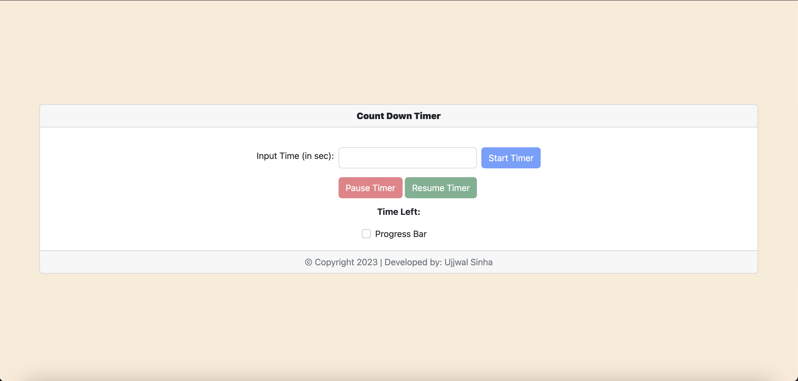
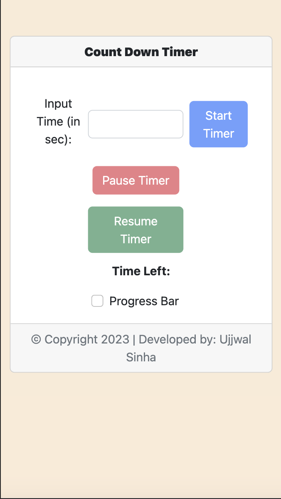

# ⏳ Count Down Timer

A Count Down Timer application where user inputs the time in Seconds featured with "Pause" and "Resume" functionality. Additionally user Selectable of Progress bar Feature is added for visual representation of the decreasing time.

Resposiveness is also added with minimum wdevice width of 667px.

### 🔗 Live URL
To try the application -
[Click Here](https://ujjwalsinha10.github.io/Count_Down_Timer/)

### 🛠️ Built With

The tech-stack used to build the application:
* HTML
* CSS
* JavaScript

### 📷 ScreenShots
#### Large Devices View

#### Small Devices View

#### Medium Devices View

## Authors

- [@UjjwalSinha10](https://github.com/ujjwalsinha10)

## License

[MIT](https://choosealicense.com/licenses/mit/)
